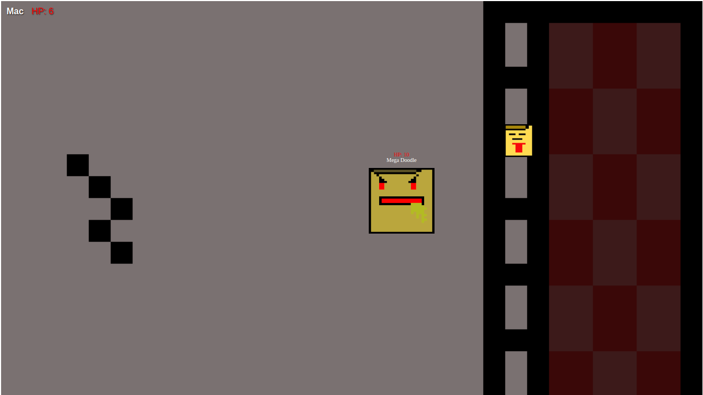
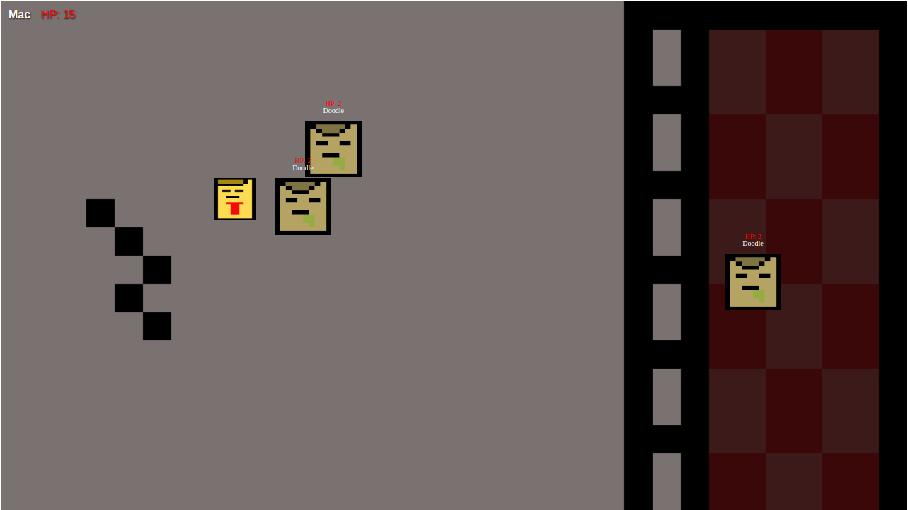

# Mac-N-Midnight

This is a browser based game that utilizes Html, css and javascript

# Live link

# Game description

This is streets of rage inspired game with tmnt and zelda elements with a funny yet original twist to the classic beat-em up scroller game.
To win this game you will be going through various enemies and bosses in each level to get mac home safely home and win the game.
Avoid enemy hits space out your attacks and use your block strategically to avoid sticky situations!

# Background info

Mac is just a noodle trying to get home from a long day at the office but when undead noodles attack his only choice is to un-alive them to get home.

# Screenshots

# Technoligies used

HTML, CSS, JAVASCRIPT, GITHUB, PIXABAY, PISKEL.

# Sites used for refrence material.

MDN, W3 SCHOOLS, GEEKS FOR GEEKS.

# Instructions For Gameplay

# Controls

Movement = "Arrow Keys"
Attack = "Spacebar"
Block = "b"

# Player

15 hp once depleted youll switch between each life, once lives are depleted gameover!
hits are recorded on player based on collision.
player has a 120 range and a 360 atk with a 1 second cooldown.
player a block that last 1.2 seconds with a cooldown of 1.2 seconds this allows you to move through enemies without taking damage.

# IceBox

-make player change image when hit by enemy
-fix overlap for enemys/bosses
-include item container/ 3 usuable slots/6 different items to use with single use function binded to "x,c,v" keys
-have enemy drop items and allow player to pick them up and auto add from 0-2 arr for item container and clear item after use and pickup
-9 more levels ,more maps ,enemies, bosses ,sounds , music
-player image change on direction macs facing
-add lives and life depletion make 0 = gameover
-add highscore and point system for each level based on items held full slots= more points for each, items used = less points, player lives and hp are also factors 
